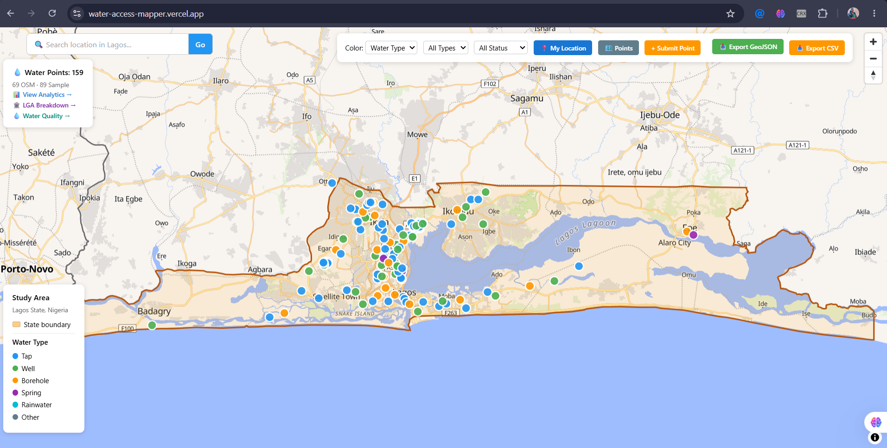
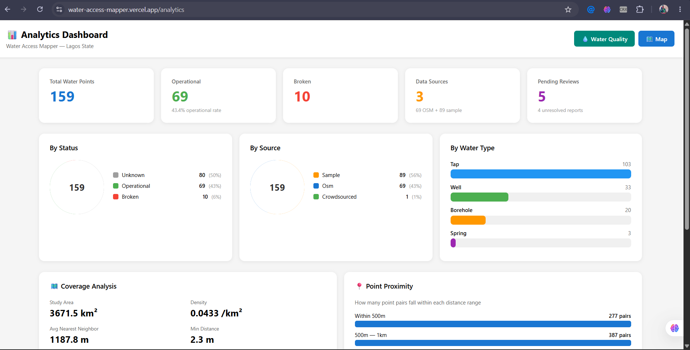
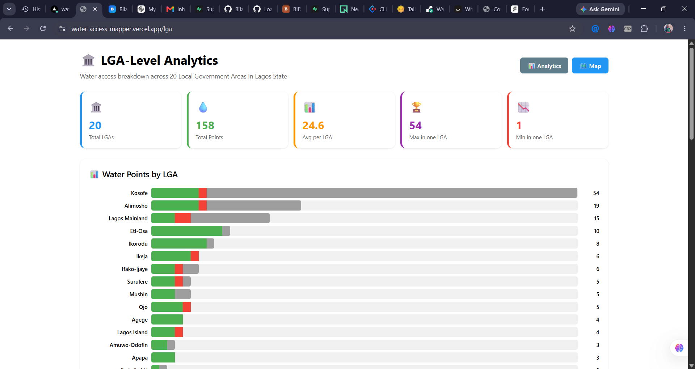
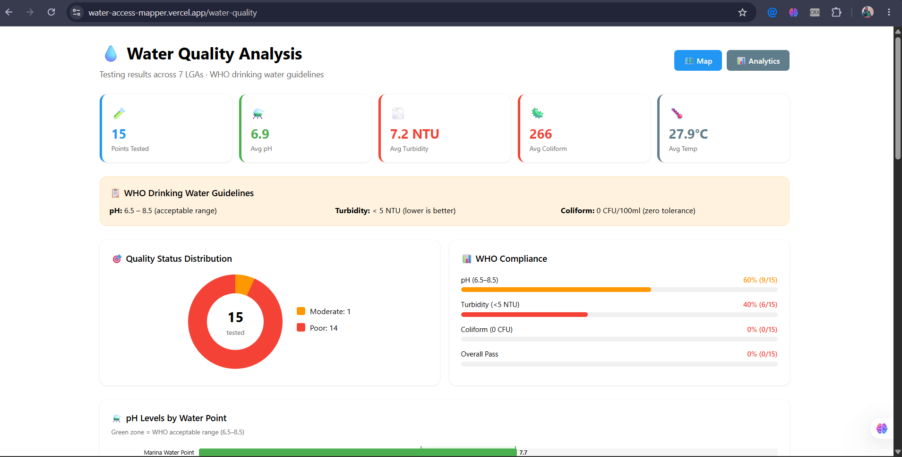
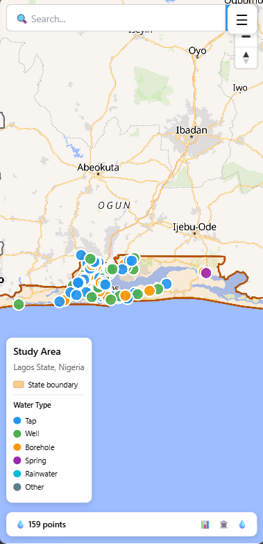

# 🌊 Water Access Mapper

> An interactive geospatial web application for mapping, analyzing, and improving water point accessibility across Lagos State, Nigeria.

[](https://nextjs.org/)
[](https://fastapi.tiangolo.com/)
[](https://postgis.net/)
[](https://maplibre.org/)
[](https://python.org/)
[](https://typescriptlang.org/)

**🌐 Live:** [water-access-mapper.vercel.app](https://water-access-mapper.vercel.app)
**📡 API:** [water-access-mapper-api.onrender.com](https://water-access-mapper-api.onrender.com)
**📖 API Docs:** [water-access-mapper-api.onrender.com/docs](https://water-access-mapper-api.onrender.com/docs)

---

## 📸 Screenshots

> **To add screenshots:** Take screenshots of the pages below and save them to `docs/screenshots/`. Then uncomment the image lines in this section.

<!-- Uncomment and update paths after taking screenshots:

### 🗺️ Interactive Map

*Interactive map showing 159 water points across Lagos State with real OCHA HDX boundary, OpenFreeMap vector tiles, and walking route navigation.*

### 📊 Analytics Dashboard

*Real-time analytics with water point statistics, status breakdowns, and data quality metrics.*

### 🏛️ LGA-Level Analytics

*Water access breakdown across all 20 Local Government Areas with density comparison and sortable data table.*

### 💧 Water Quality Analysis

*WHO drinking water guideline compliance with pH, turbidity, and coliform charts across tested LGAs.*

### 📱 Mobile Responsive

*Fully responsive design with hamburger menu, compact stats bar, and touch-friendly controls.*

### 📥 Data Export

*Download water points as GeoJSON for QGIS or CSV for spreadsheet analysis.*

-->

---

## 🎯 Problem Statement

Access to clean water remains a critical challenge in Lagos State, Nigeria — a megacity of over 20 million people. Communities often lack comprehensive, up-to-date information about available water points, their operational status, and accessibility.

**This project addresses that gap** by creating an interactive, data-driven platform that:

- Combines real OpenStreetMap data with crowdsourced submissions
- Provides spatial analysis to identify underserved areas
- Offers walking route navigation to the nearest water point
- Enables community reporting of broken or incorrect water points

---

## 🗺️ Study Area

**Lagos State, Nigeria** — the most populous state in Nigeria and one of the largest metropolitan areas in Africa.

| Property | Value |
|----------|-------|
| **Area** | 3,671.5 km² |
| **Boundary source** | OCHA HDX COD-AB (CC BY-IGO) |
| **Coordinates** | 6.37–6.70°N, 2.70–4.35°E |
| **LGAs covered** | All 20 Local Government Areas |
| **Total water points** | 159 (69 OSM + 89 sample + 1 crowdsourced) |
| **Water quality tested** | 15 points across 7 LGAs |

---

## 🏗️ Architecture

```
┌─────────────────────────────────────────────────┐
│          Frontend (Next.js 14 + React)           │
│    MapLibre GL JS · TypeScript · Tailwind CSS    │
│    OpenFreeMap vector tiles (no API key)         │
└──────────────────────┬──────────────────────────┘
                       │ REST API (JSON)
                       ▼
┌─────────────────────────────────────────────────┐
│              Backend (FastAPI)                    │
│    30+ endpoints · Spatial queries               │
│    OSRM routing · Crowdsourcing · Analytics      │
└──────────────────────┬──────────────────────────┘
                       │ asyncpg + SQLAlchemy
                       ▼
┌─────────────────────────────────────────────────┐
│      Database (Neon PostgreSQL + PostGIS)         │
│    water_points · lga_boundaries                  │
│    water_quality · submissions · reports          │
│    Spatial indexes (GIST) · KNN operator          │
└─────────────────────────────────────────────────┘
```

### Key Design Decisions

- **No Docker** — runs locally with Node.js, Python venv, and Neon PostgreSQL
- **OpenFreeMap** — free vector tiles with no API key or rate limits
- **Neon** — serverless PostgreSQL with PostGIS (migrated from Supabase free tier)
- **OSRM** — OpenStreetMap-based walking route calculations
- **Unverified data workflow** — crowdsourced submissions require admin approval

---

## 🔧 Technology Stack

| Layer | Technology | Why |
|-------|-----------|-----|
| **Frontend** | Next.js 14, React 18, TypeScript | SSR/SSG, type safety, React ecosystem |
| **Maps** | MapLibre GL JS | Open-source, vector/raster tile support |
| **Tile Provider** | OpenFreeMap | Free, no API key, no rate limits |
| **Backend** | Python 3.11, FastAPI | Async support, automatic API docs, Pydantic validation |
| **Database** | PostgreSQL 15 + PostGIS 3.3 | Spatial indexing, KNN queries, geodesic distance |
| **Hosting** | Vercel (frontend) + Render (backend) + Neon (database) | Free tier deployment |
| **Routing** | OSRM (Open Source Routing Machine) | OSM road network, walking profile |
| **Geospatial** | GeoPandas, Shapely, NumPy | Geometry validation, spatial operations |
| **Search** | Nominatim (OpenStreetMap) | Free geocoding, no API key |

---

## 📊 Features

### Core Features
- 🗺️ **Interactive Map** — OpenFreeMap vector tiles with 159 water points
- 🔍 **Location Search** — Nominatim geocoding (type any Lagos location)
- 🔥 **Heatmap Toggle** — Density visualization showing concentration
- 🚶 **Walking Routes** — OSRM network-based routes with distance/time
- 📍 **Geolocation** — Find your position on the map
- 🎯 **Filters** — By water type (tap/well/borehole/spring) and status

### Analytics
- 📊 **Analytics Dashboard** — Summary stats, donut charts, bar charts
- 🏛️ **LGA Breakdown** — Water access across all 20 LGAs with density comparison
- 💧 **Water Quality** — WHO guideline compliance with pH/turbidity/coliform charts
- 📈 **Coverage Analysis** — Proximity analysis and underserved area identification

### Data Management
- 📥 **Data Export** — Download as GeoJSON (for QGIS) or CSV (for spreadsheets)
- 📝 **Crowdsourcing** — Submit new water points or report broken ones
- ✅ **Unverified Workflow** — Submissions require admin approval
- 🔐 **Data Provenance** — Track source (OSM/sample/crowdsourced) for each point

### Technical
- 📱 **Mobile Responsive** — Full responsive design with hamburger menu
- 🧪 **30 Passing Tests** — PostGIS, API, spatial, crowdsourcing, analytics
- 🚀 **Deployed** — Live on Vercel + Render + Neon

---

## 🌐 API Endpoints (30+)

### Core
| Method | Endpoint | Description |
|--------|----------|-------------|
| GET | `/health` | Service status and version |
| GET | `/database` | PostgreSQL + PostGIS version |
| GET | `/docs` | Swagger UI interactive documentation |

### Water Points
| Method | Endpoint | Description |
|--------|----------|-------------|
| GET | `/api/water-points/geojson` | All water points as GeoJSON |
| GET | `/api/water-points/stats` | Counts by status, type, source |
| GET | `/api/study-areas/geojson` | Lagos State boundary polygon |

### Spatial Queries
| Method | Endpoint | Description |
|--------|----------|-------------|
| GET | `/api/spatial/nearest?lat=&lon=` | Nearest water point (KNN) |
| GET | `/api/spatial/within-radius?lat=&lon=&radius_meters=` | Points within radius |
| GET | `/api/spatial/density` | Grid-based density |

### Routing
| Method | Endpoint | Description |
|--------|----------|-------------|
| GET | `/api/routing/to-nearest?lat=&lon=` | Walking route to nearest |
| GET | `/api/routing/to-point?lat=&lon=&target_id=` | Route to specific point |

### LGA Analytics
| Method | Endpoint | Description |
|--------|----------|-------------|
| GET | `/api/lga/analytics` | Water access by LGA |
| GET | `/api/lga/summary` | Quick LGA summary stats |
| GET | `/api/lga/boundaries` | LGA boundaries as GeoJSON |

### Water Quality
| Method | Endpoint | Description |
|--------|----------|-------------|
| GET | `/api/water-quality/summary` | Quality summary stats |
| GET | `/api/water-quality/by-lga` | Quality breakdown by LGA |
| GET | `/api/water-quality/geojson` | Tested points as GeoJSON |
| POST | `/api/water-quality/submit` | Submit new test result |

### Crowdsourcing
| Method | Endpoint | Description |
|--------|----------|-------------|
| POST | `/api/crowd/submit` | Submit new water point |
| POST | `/api/crowd/report` | Report broken/incorrect point |
| GET | `/api/crowd/submissions` | List submissions |
| GET | `/api/crowd/reports` | List reports |
| POST | `/api/crowd/approve/{id}` | Approve submission (admin) |
| POST | `/api/crowd/reject/{id}` | Reject submission (admin) |
| POST | `/api/crowd/resolve/{id}` | Resolve report (admin) |

### Export
| Method | Endpoint | Description |
|--------|----------|-------------|
| GET | `/api/export/geojson` | Download all points as GeoJSON |
| GET | `/api/export/csv` | Download all points as CSV |

---

## 🧪 GIS Analysis

### 1. Nearest Neighbor (KNN)
Uses PostGIS KNN operator (`<->`) for efficient spatial indexing:
```sql
SELECT name, ST_Distance(geometry::geography, point::geography) AS distance
FROM water_points
ORDER BY geometry <-> point
LIMIT 1;
```

### 2. Radius Search (ST_DWithin)
Geodesic distance search using geography type:
```sql
SELECT * FROM water_points
WHERE ST_DWithin(geometry::geography, point::geography, :radius_meters);
```

### 3. Walking Route Calculation
OSRM foot profile provides network-based walking routes with turn-by-turn instructions.

### 4. Accessibility Classification
5 distance categories from Excellent (0–500m) to Critical (>5km).

### 5. Density Analysis
Grid-based density calculation identifying underserved areas.

### 6. LGA Spatial Join
`ST_Contains` assigns each water point to its Local Government Area boundary.

---

## 📁 Project Structure

```
water-access-mapper/
├── apps/
│   ├── web/                          # Next.js frontend
│   │   └── src/
│   │       ├── app/
│   │       │   ├── page.tsx          # Map page
│   │       │   ├── analytics/        # Analytics dashboard
│   │       │   ├── lga/              # LGA-level analytics
│   │       │   └── water-quality/    # Water quality charts
│   │       └── components/
│   │           └── MapView.tsx       # Main map component
│   └── api/                          # FastAPI backend
│       ├── main.py                   # App entry point
│       ├── database.py               # DB connection (asyncpg)
│       ├── config.py                 # Settings
│       └── routes/
│           ├── water_points.py       # GeoJSON endpoints
│           ├── spatial_queries.py    # PostGIS analysis
│           ├── routing.py            # OSRM routing
│           ├── accessibility.py      # Coverage model
│           ├── crowdsourcing.py      # Submissions & reports
│           ├── analytics.py          # Dashboard stats
│           ├── lga_analytics.py      # LGA breakdown
│           ├── water_quality.py      # Quality data
│           └── export.py             # GeoJSON/CSV download
├── scripts/
│   ├── fetch_lagos_boundary.py       # OCHA HDX boundary download
│   └── osm_water_points.py           # Expanded OSM loader
├── tests/                            # 30 pytest tests
├── PROJECT_SPEC.md                   # Full project specification
└── PROGRESS.md                       # Task progress tracker
```

---

## 🚀 Deployment

| Service | Provider | URL |
|---------|----------|-----|
| **Frontend** | Vercel | [water-access-mapper.vercel.app](https://water-access-mapper.vercel.app) |
| **Backend** | Render | [water-access-mapper-api.onrender.com](https://water-access-mapper-api.onrender.com) |
| **Database** | Neon | Serverless PostgreSQL + PostGIS |

---

## 🧪 Test Results

**30 tests passing** across 5 test files:

```
tests/test_health.py          — 2 tests ✅
tests/test_water_points.py    — 10 tests ✅
tests/test_spatial.py         — 6 tests ✅
tests/test_crowdsourcing.py   — 7 tests ✅
tests/test_analytics.py       — 7 tests ✅
```

Tests run against the live API with real PostGIS queries.

---

## ⚠️ Limitations

1. **Sample data** — 89 of 159 points are fabricated for demonstration (clearly labeled)
2. **OSM coverage** — OpenStreetMap data varies by region; rural areas may have fewer mapped points
3. **Routing** — OSRM routing is based on the OSM road network; informal paths may not be included
4. **Water quality** — 15 tested points (sample data), not comprehensive testing
5. **No offline support** — Requires internet for map tiles and API calls

---

## 🔮 Future Improvements

- **Admin Dashboard** — Review/approve crowdsourced submissions with auth
- **Multi-country support** — Expand beyond Lagos State
- **Real-time monitoring** — IoT integration for water point status
- **Mobile PWA** — Offline-first progressive web app
- **Satellite imagery** — ML-based water point detection
- **Multi-language** — Yoruba and Pidgin translations
- **Time-series tracking** — Historical water point status changes
- **Embeddable map** — iframe embed code for other sites

---

## 📄 License

This project is for educational and portfolio purposes.

- OSM data: [ODbL](https://opendatacommons.org/licenses/odbl/) (attribution required)
- OCHA boundary: CC BY-IGO (attribution required)

---

## 👤 Author

**Bilaal Adenuga** — Surveying & Geoinformatics Student

Demonstrating proficiency in:
- 🌍 GIS and spatial analysis
- 🗄️ PostGIS spatial databases
- 🐍 Python geospatial processing
- 🗺️ Web GIS with MapLibre GL JS
- ⚡ Full-stack development (Next.js + FastAPI)
- 📊 Data quality and validation
- 🔧 Open-source geospatial tools
